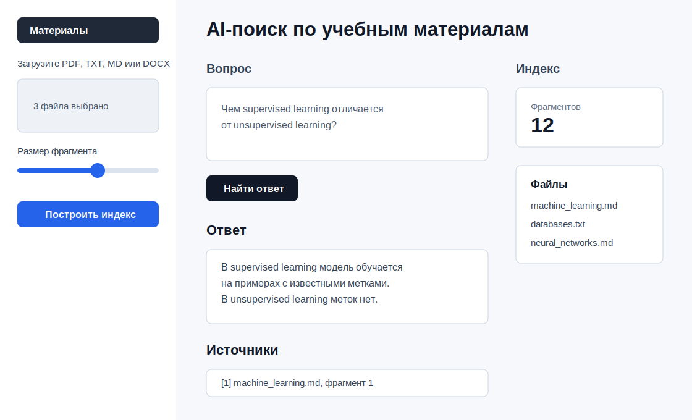

# AI-поиск по учебным материалам

[](https://github.com/tkatrin/ai-study-materials-rag/actions/workflows/tests.yml)


Локальный RAG-сервис для конспектов, PDF, Markdown, TXT и DOCX. Пользователь загружает учебные материалы, система извлекает текст, режет его на фрагменты, строит эмбеддинги через Sentence Transformers, сохраняет их в FAISS и отвечает на вопросы по найденному контексту. По умолчанию включен extractive-режим, а для настоящей генерации можно подключить локальную Ollama-модель.



## Возможности MVP

- загрузка файлов `.pdf`, `.txt`, `.md`, `.docx`;
- извлечение и нормализация текста;
- разбиение документов на перекрывающиеся фрагменты;
- построение эмбеддингов моделью `sentence-transformers/paraphrase-multilingual-MiniLM-L12-v2`;
- хранение и поиск похожих фрагментов в FAISS;
- фильтрация retrieval по минимальному score;
- Streamlit-интерфейс для загрузки файлов и вопросов;
- опциональная LLM-генерация через Ollama;
- сохранение и загрузка локального FAISS-индекса;
- вывод ответа вместе с источниками: файл, номер фрагмента и цитата.

## Архитектура

```text
app.py
  -> document_loader  -> PDF/TXT/MD/DOCX text extraction
  -> chunker          -> overlapping text chunks
  -> embedder         -> Sentence Transformers vectors
  -> vector_store     -> FAISS index + chunk metadata
  -> rag_chain        -> answer prompt + extractive fallback
  -> llm              -> optional Ollama generation
```

Основные модули находятся в `rag_service/`:

- `document_loader.py` загружает документы и возвращает текст с метаданными;
- `chunker.py` режет текст на фрагменты с overlap;
- `embedder.py` создает эмбеддинги;
- `vector_store.py` добавляет, ищет, сохраняет и загружает FAISS-индекс;
- `rag_chain.py` формирует ответ по найденным фрагментам;
- `llm.py` подключает локальную Ollama-модель;
- `pipeline.py` связывает шаги индексации и вопроса-ответа.

## Быстрый запуск

```bash
python3 -m venv .venv
source .venv/bin/activate
pip install -r requirements.txt
streamlit run app.py
```

После запуска откройте локальный адрес, который покажет Streamlit, обычно `http://localhost:8501`.

## Настройки

Основные значения по умолчанию показаны в `.env.example`. Приложение читает эти ключи из переменных окружения:

- `RAG_INDEX_DIR` — папка сохраненного FAISS-индекса;
- `RAG_UPLOAD_DIR` — папка загруженных файлов;
- `RAG_EMBEDDING_MODEL` — embedding-модель;
- `RAG_CHUNK_SIZE` и `RAG_CHUNK_OVERLAP` — параметры чанкинга;
- `RAG_TOP_K` и `RAG_MIN_SCORE` — параметры retrieval;
- `OLLAMA_URL` и `OLLAMA_MODEL` — настройки LLM-режима.

## LLM-режим через Ollama

Extractive-режим работает без LLM и выбирает предложения по простой эвристике пересечения слов. Это полезный fallback и smoke-check retrieval, но качественный режим для демонстрации RAG — `Ollama`, где ответ генерируется по найденному контексту. Для генеративного RAG запустите локальную Ollama-модель:

```bash
ollama serve
ollama pull llama3.1
```

В интерфейсе выберите режим `Ollama`, оставьте URL `http://localhost:11434` и укажите модель, например `llama3.1`. Если Ollama недоступна, приложение покажет предупреждение и вернется к extractive-ответу.

## Сохранение индекса

После построения индекса нажмите `Сохранить индекс`. FAISS-индекс, метаданные чанков и название embedding-модели будут сохранены в `data/index/default`. После перезапуска приложения можно нажать `Загрузить сохраненный индекс` и не пересчитывать эмбеддинги заново. Если текущая embedding-модель отличается от модели сохраненного индекса, приложение не загрузит индекс, чтобы не смешивать несовместимые векторные пространства.

## Пример набора документов

В папке `examples/` лежат небольшие учебные файлы:

- `machine_learning.md`;
- `databases.txt`;
- `neural_networks.md`;
- `eval_questions.json` с простыми вопросами для проверки retrieval.

Их можно загрузить в интерфейсе, нажать `Построить индекс` и задать вопрос.

## Пример вопроса и ответа

Вопрос:

```text
Чем supervised learning отличается от unsupervised learning?
```

Пример ответа:

```text
В supervised learning модель обучается на примерах, где для каждого объекта известен правильный ответ. В unsupervised learning модель получает данные без заранее известных меток и ищет скрытую структуру.

Использованные фрагменты: [1]
```

Источник:

```text
[1] machine_learning.md, фрагмент 1:
В supervised learning модель обучается на примерах, где для каждого объекта известен правильный ответ...
```

## Замечания

Первый запуск может занять время: Sentence Transformers скачает модель. После этого модель кешируется локально. Для полностью офлайн-режима заранее скачайте модель Hugging Face и укажите локальный путь в поле `Embedding-модель`.

## Тесты

```bash
pip install -r requirements-dev.txt
pytest
```

Тесты покрывают разбиение текста, загрузку TXT/MD, метаданные чанков, полный путь `build_index -> ask_question`, генераторный fallback, FAISS-поиск, сохранение embedding-модели и поведение пустого индекса.

## Docker

```bash
docker build -t study-rag .
docker run --rm -p 8501:8501 study-rag
```

Если Ollama запущена на хост-машине, укажите в интерфейсе доступный для контейнера адрес Ollama.

## Ограничения MVP

- качество ответа зависит от качества retrieval и выбранной LLM;
- extractive fallback использует простую эвристику и хуже работает с морфологией русского языка, чем LLM-режим;
- чанкинг остается простым: он сохраняет переносы строк и старается резать по разделителям, но не использует токенизатор конкретной LLM;
- PDF-парсинг работает с текстовым слоем, сканы без OCR не распознаются;
- оценка качества пока представлена небольшим ручным набором вопросов в `examples/eval_questions.json`.
