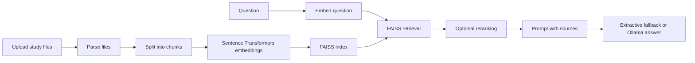

# Architecture

## Pipeline

1. `document_loader` reads source files. PDF files become page-level retrieval blocks.
2. `chunker` creates overlapping chunks and keeps metadata such as source file and page.
3. `embedder` creates normalized Sentence Transformers vectors.
4. `vector_store` saves vectors and chunk metadata in a FAISS index.
5. `pipeline` retrieves candidates by cosine similarity.
6. `reranker` can rerank a larger candidate set before final context selection.
7. `rag_chain` builds an answer from retrieved context and always returns sources.
